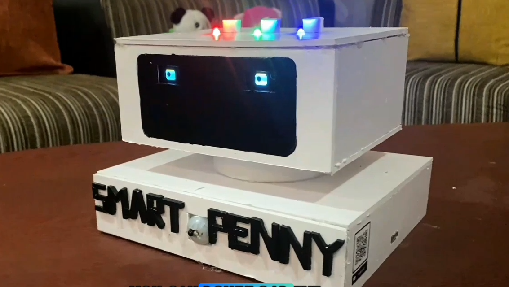
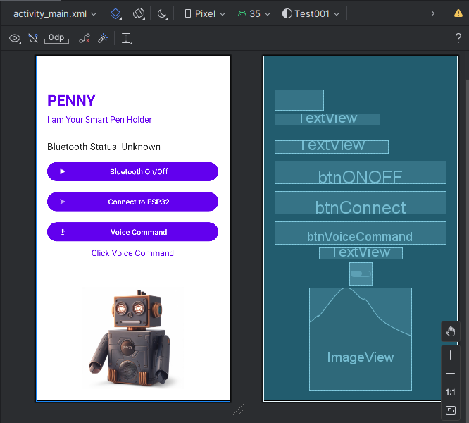

# 🚀 Penny – The Smart Robotic Pen Holder! 🖊️🤖

**Penny** is an AI-powered, voice-controlled, and motion-activated robotic pen holder designed to redefine workspace organization.  
By integrating **Human-Computer Interaction (HCI)** principles with smart automation, Penny makes accessing and managing pens effortless and interactive.

<!-- Robot Image -->

  

---

## 🔹 Key Features

- ✅ **Voice Commands** – Request a pen via a Bluetooth-connected Android app.
- ✅ **Automated Pen Detection & Ejection** – Uses IR & TCS3200 color sensors for precise pen selection.
- ✅ **Interactive OLED Display** – Penny’s animated "eyes" react to user interactions.
- ✅ **Motion-Based Activation** – IR sensor turns Penny on/off—no manual switches needed!
- ✅ **Real-Time Feedback** – LED indicators & voice responses for misplaced or missing pens.
- ✅ **Rechargeable & Energy-Efficient** – Powered by lithium-ion batteries for long-lasting use.

---

## 📱 Mobile Application (Android Studio)

A companion **mobile app** was developed using **Android Studio** to provide seamless voice and touch control over Penny.  
The app connects via **Bluetooth**, allowing users to:

- 🎙️ Send voice commands to request pens  
- 📊 View real-time status and feedback  
- ⚙️ Configure preferences such as sensitivity and mode  

**Mobile App UI Preview:**  

  

---

## 🎯 Why Penny?

Penny transforms a simple daily task into an engaging, intelligent experience.  
This project showcases expertise in **AI**, **IoT**, and **automation**, combining functionality with personality while pushing the boundaries of **HCI** and **smart workspace solutions**.

---

## 💡 What I Learned

- 🔹 **Embedded C Programming** – Optimizing microcontroller performance.  
- 🔹 **Microcontroller Power Management** – Designing for efficient energy consumption.  
- 🔹 **Voltage Level Shifting** – Interfacing components with different power requirements.  
- 🔹 **3.3V vs 5V Power Rails** – Managing components that operate at different voltage levels.  

---

## 🚀 What’s Next?

Future versions of Penny could evolve into a **smart study assistant**, featuring:

- 🔹 **AI-Powered Interaction** – Personalized reminders based on user behavior.  
- 🔹 **Smart Study Mode** – Detecting study sessions and suggesting breaks.  
- 🔹 **Gesture Recognition** – Enabling hands-free control for added convenience.  
- 🔹 **Smart Home Integration** – Syncing with lights and timers for optimized study environments.  

---

## 🌟 Huge Thanks to My Team!

A huge shoutout to **Thisara Shehan Kavinda**, **Ovinda Vidushan**, and **Dithmi Lakrandi** — your creativity and dedication made Penny a reality!  
Special thanks to our mentors and supporters who guided us throughout the journey.

---

## 🎥 Demo Video

🎬 Watch the live demo on LinkedIn:  
👉 [Penny Demo Video](https://www.linkedin.com/posts/kavindu-hansana_ai-iot-automation-activity-7302898214641262592-W7Og?utm_source=share&utm_medium=member_desktop&rcm=ACoAAEduKX8BH8jzgkE1PNds4VfMt5_6Q-XBfMc)

---

## 📢 Feedback

We’d love to hear your thoughts!  
💬 How do you see Penny evolving? Drop your feedback and ideas — let’s build the future together, one smart solution at a time! 🚀
